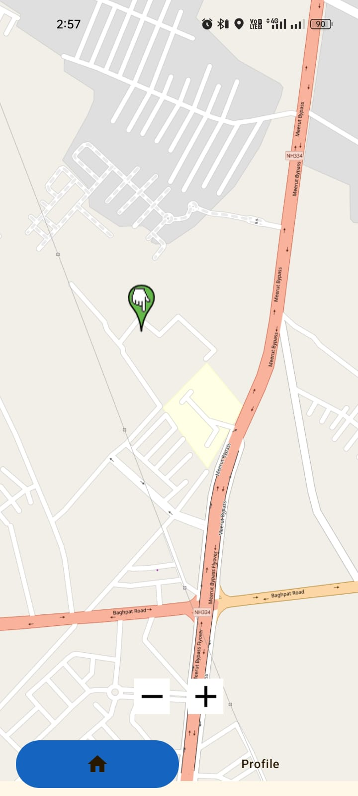
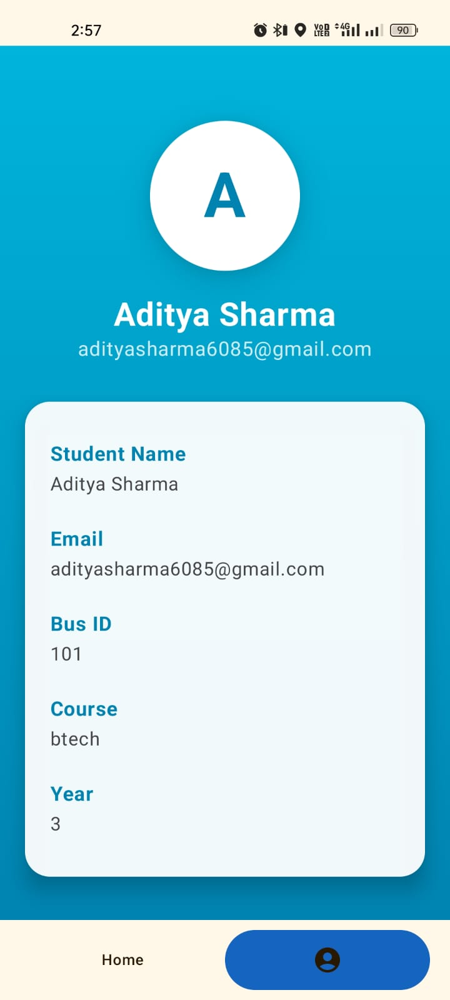

🎓 College Student App

The College Student App is a lightweight Android application built to demonstrate real-time bus tracking using Firebase and OpenStreetMap (OSMDroid).

The app listens to live GPS coordinates uploaded by the College Driver App and reactively updates the map UI to move the bus marker in real time.
This project focuses on reactive state handling, map integration, and clean architecture, rather than complex UI or features.

🎯 Project Objective
  * Listen to live bus location updates from Firebase
  * Display bus movement in real time on OpenStreetMap
  * Reactively update UI when location changes
  * Follow MVVM + Clean Architecture
  * Use Kotlin Coroutines & StateFlow
  * Keep the app simple to clearly demonstrate Android fundamentals

📱 Screens
| StudentHomeScreen | TrackCollegeBusScreen| StudentProfile |
|------------|--------|--------|
|  |  |  | 
	
🧠 Application Workflow
  1. Student opens the app
  2. App listens to latitude & longitude from Firebase
  3. Location data is collected in ViewModel
  4. Student clicks Trace Bus button
  5. OpenStreetMap screen opens
  6. Bus marker is placed on the map
  7. Marker position updates in real time as Firebase data changes

🔗 Related Project

  🚍 College Driver App
    👉 https://github.com/adityasharma455/College_Driver_App

(The Driver App uploads live GPS data which this app consumes.)

🚀 Key Features
  * Firebase real-time location listener
  * Live bus tracking on OpenStreetMap (OSMDroid)
  * Moving marker based on latitude & longitude changes
  * Reactive UI updates using StateFlow
  * Clean and minimal UI
  * Simple navigation flow

🧩 Tech Stack
  # Category	             ->   Technology
  * Language	             ->   Kotlin
  * UI	                   ->   Jetpack Compose
  * Architecture	         ->   MVVM + Clean Architecture
  * State Management	     ->   StateFlow
  * Concurrency	           ->   Kotlin Coroutines
  * Maps                   -> 	OpenStreetMap (OSMDroid)
  * Backend	               ->   Firebase
  * Dependency Injection   ->  	Koin

  
🏗 Architecture Overview
Presentation Layer
│
├── HomeScreen (Jetpack Compose)
├── MapScreen (OSMDroid)
├── HomeViewModel (StateFlow)
│
Domain Layer
│
├── LocationUseCase
│
Data Layer
│
├── Repository
├── Firebase Location Listener

🧩 Home Screen Logic (High Level)
  * Collects latitude & longitude from Firebase
  * Exposes location state via StateFlow
  * Navigates to map screen on Trace button click
  * Keeps UI reactive to location changes

🧩 Map Screen Logic (High Level)
  * Initializes OpenStreetMap
  * Places bus marker on first location update
  * Updates marker position when StateFlow emits new coordinates
  * Keeps map UI synced with real-time data

 
⚠️ Challenges Faced
1. Real-Time Marker Movement on Map

Updating the marker smoothly whenever location changes was challenging.

Solution:
Observed Firebase updates using StateFlow and updated marker position reactively.

2. Map Lifecycle Handling

Handling map initialization and avoiding unnecessary reloads.

Solution:
Managed map state properly and separated UI & logic using ViewModel.

3. Firebase Listener Management

Continuous listeners can cause memory leaks if not handled correctly.

Solution:
Attached and detached listeners safely through repository layer.

🛠 Permissions Used
  * INTERNET
  * ACCESS_NETWORK_STATE
(Location permission is not required, as this app only listens to Firebase.)

🚀 Setup Instructions
  !. Clone repository 
      git clone https://github.com/adityasharma455/College_Student_App.git
  2. Open in Android Studio
  3. Add google-services.json in app/
  4. Enable Firebase services:
    * Realtime Database
  5. Build & Run 🚀

👨‍💻 Author

Aditya Sharma
🎓 3rd Year Computer Science Student
📱 Android Developer | Kotlin | Jetpack Compose | Firebase

🔗 GitHub: https://github.com/adityasharma455
